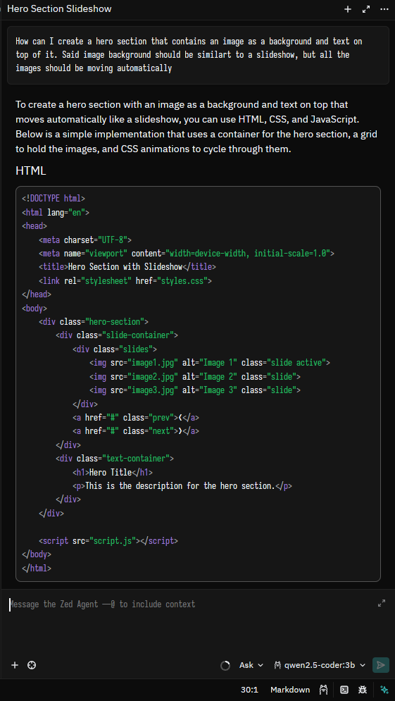

# Configuring a model as a Zed Agent
Zed allows for an easy way to add agents on the editor, these agents are able to plan a codebase, answer questions about a codebase, and also modify the codebase itself.

## Configure Zed
Open the `settings.json` file of Zed and add the following configuration to it.

```json
"agent": {
    "default_profile": "ask",
    "default_model": {
      "provider": "<YOUR_PROVIDER>",
      "model": "<YOUR_MODEL>",
      "enable_thinking": false
    },
    "dock": "right",
    "favorite_models": [],
    "model_parameters": []
  },
```

There are multiple options you can use here to modify how the agent works on Zed, some of them are.

- `default_profile`: This lets you select the default profile that the agent will take, this can easily be changed to *Write* or *Minimal*, which are the other two defaults Zed comes with, but you can easily create more.
- `enable_thinking`: As the name suggests, this will allow you to enable thinking processes for the model, which will make the user take longer to provide an answer, but probably improve the quality of it.

After the settings on the `settings.json` file are saved you should see this icon on the bottom left or bottom right (depending on your `dock` setting option).

When you open it, you can start interacting with the agent, in the text area you will also have more settings that you can modify to change how the agent works.

